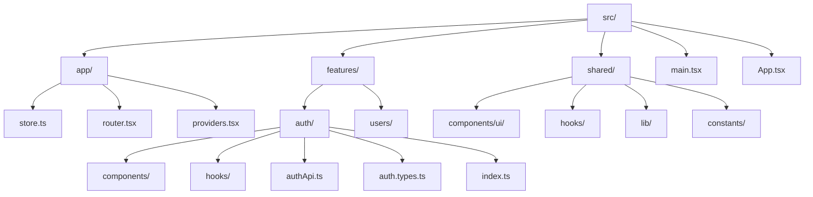

# Folder Structure

The canonical feature-based structure of the application. See [07-folder-structure.md](../docs/07-folder-structure.md).

**Key idea:** every feature is self-contained and mirrors the same layout, exposing a public `index.ts`.
