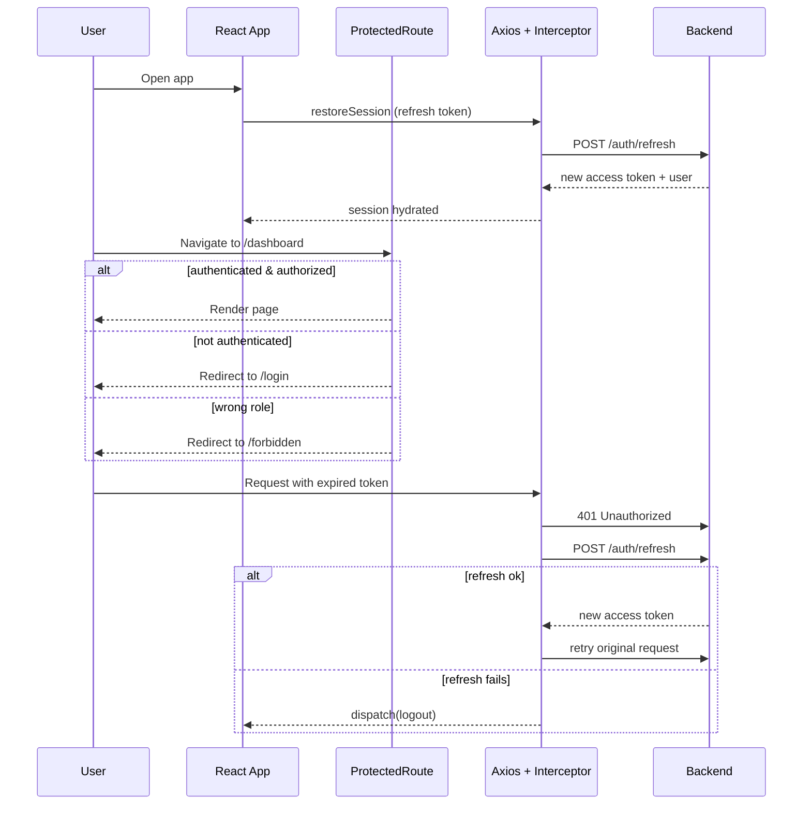

# Authentication Flow

JWT access/refresh token flow with route guards. See [17-authentication.md](../docs/17-authentication.md).

**Key idea:** tokens are handled centrally by interceptors; guards enforce access; the server is the security authority.
