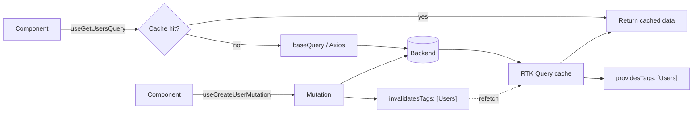

# RTK Query Flow

Caching, hooks, and tag-based invalidation. See [14-rtk-query.md](../docs/14-rtk-query.md).

**Key idea:** queries provide tags, mutations invalidate them, and cached reads refresh automatically — no manual wiring.
