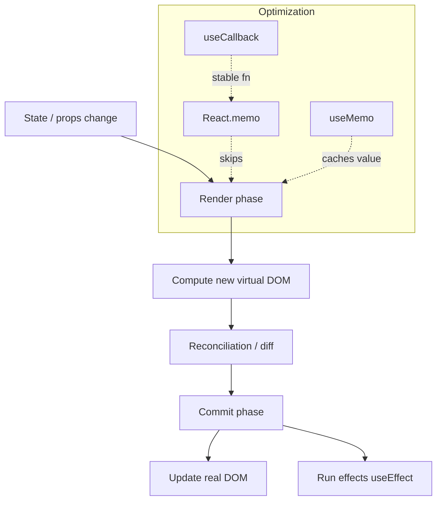

# React Rendering

How React renders and re-renders. See [09-react.md](../docs/09-react.md) and [24-performance.md](../docs/24-performance.md).

**Key idea:** re-render is triggered by state/prop changes; memoization skips work only when props are referentially stable — and only where profiling justifies it.
