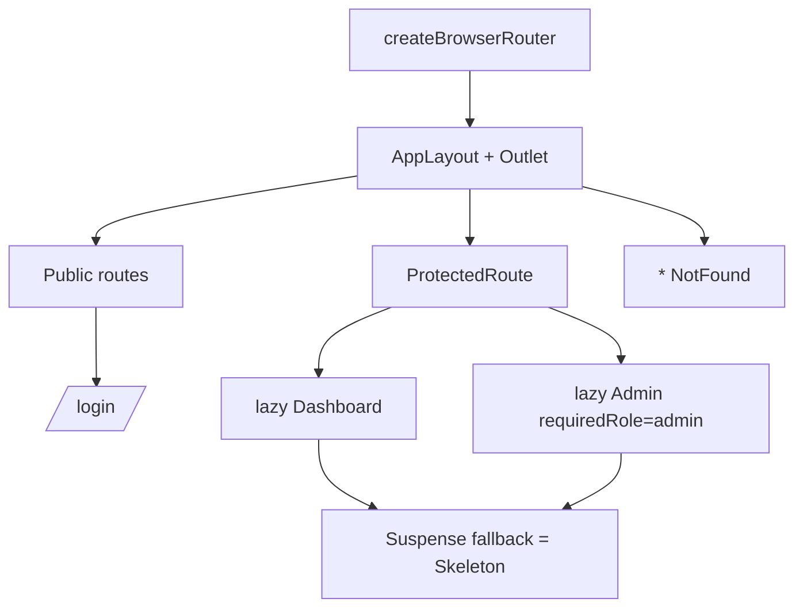

# Routing

Nested layouts, lazy routes, and guards. See [12-react-router.md](../docs/12-react-router.md).

**Key idea:** one central config, shared layout via `<Outlet />`, lazy-loaded pages, and guarded private routes.
