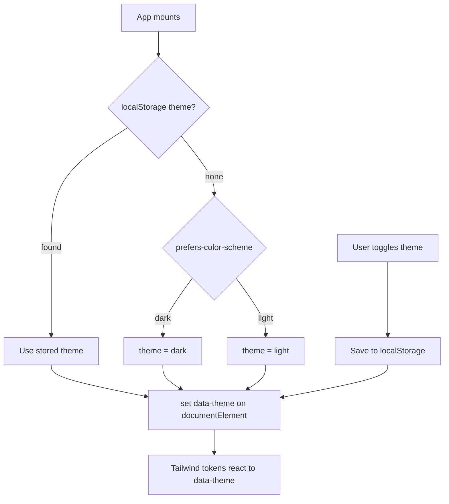

# Theme Provider

Dark/light mode with system preference and persistence. See [30-best-practices.md](../docs/30-best-practices.md).

**Key idea:** theme is centralized, respects system preference on first load, persists user choice, and drives Tailwind tokens.
