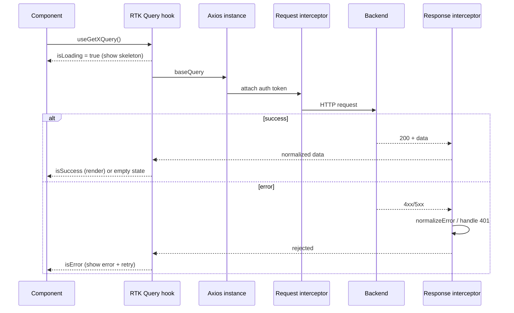

# Request Lifecycle

Full lifecycle of a data request through the stack. See [16-axios.md](../docs/16-axios.md) and [25-error-handling.md](../docs/25-error-handling.md).

**Key idea:** every request passes through interceptors for auth and error normalization; the UI always reflects loading, success, empty, or error.
